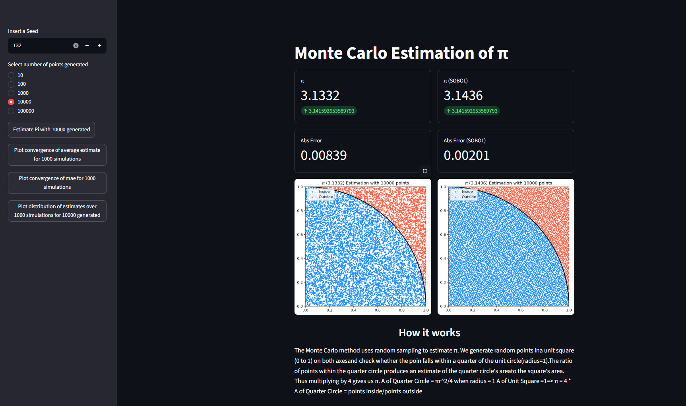
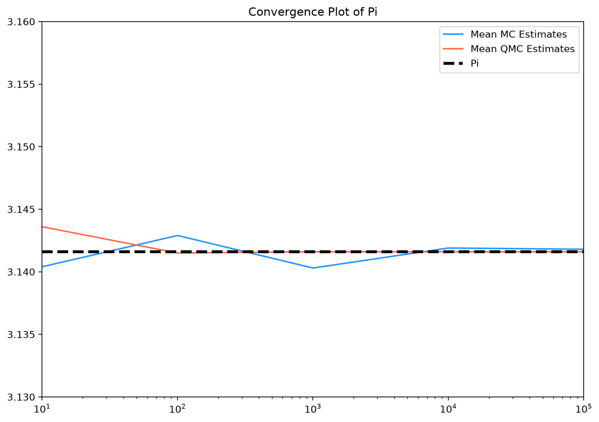
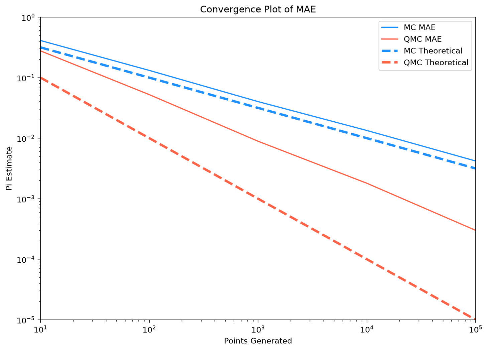
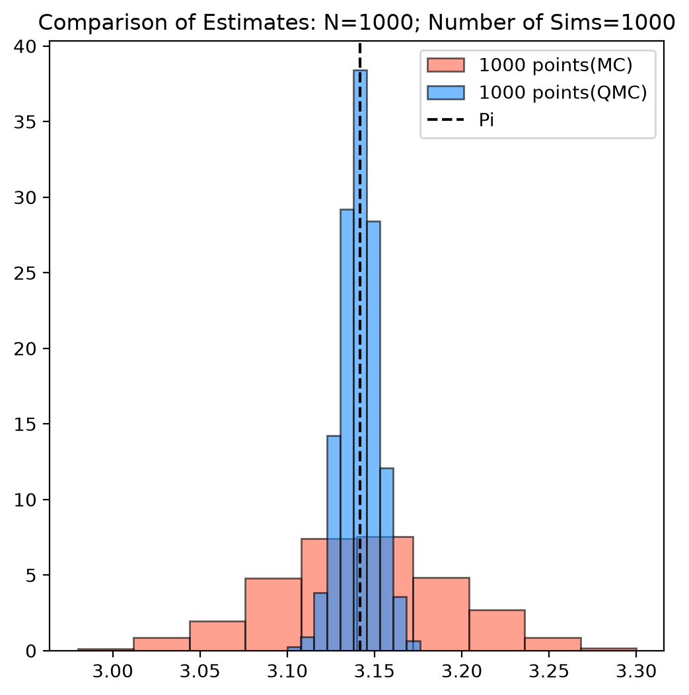

# 🎯 Monte Carlo Estimation of π (Interactive App)

This project is an interactive web application built with Streamlit that demonstrates how to estimate π using a Monte Carlo simulation. Users can experiment with different sample sizes and visually observe how the approximation improves as the number of random points increases. 

---

---
## Example Plots








---
## 🚀 Live Demo

*Streamlit deployment coming soon*

---

## 📌 Overview

The Monte Carlo method estimates π by randomly generating points inside a unit square and measuring how many fall inside a quarter circle.

Since:

* Area of quarter circle = π/4
* Area of square = 1

We can estimate:

π ≈ 4 × (points inside circle / total points)

This app allows users to explore this concept interactively.

---

## ❓Why Monte Carlo

Monte Carlo simulations and integration are an integral part of various technical fields such as scientific computing, finance (risk management) and bayesian machine learning
as it provides a trivial way to approximate possible deterministic events using randomness. As a prospective mathematics graduate student, I was interested in utilizig this
numerical method as I find fascinating how geometry and stochastics could be used to approximate such a pivotal mathematical figure in Pi.

## Monte Carlo vs Quasi Monte Carlo

These are both methods of numerical integration and simulation, however they differ in how the sample points are generated and in their convergence properties. In this project I chose
to use SOBOL as my Quasi Monte Carlo Method. A comparison in methods can be found in the table below:

| Monte Carlo | Sobol |
|-------------|---------------------------------------------------------------------------------|
|Sampling in pseudorandom|Sampling is deterministic and designed to be more uniformly distributed|
|O(N^-0.5) Convergence | O(n^-1) Convergence|
|Simple and robust|More complicated to implement|
|Slow convergence|Faster convergence|
|Works well in high dimension|Works best in low-medium dimension|


## Optimizations

Naive for loops in Python abided by a time constraint of O(n) which, after utlizing, I found to be too slow for my use case. Thus, I utilized NumPy vectorization to 
then increase the speed of my estimation when multiple simulations were needed. Outside of raw computational speed, optimizations can be made in the mathematical accuracy of the estimations
by using a quasi monte carlo method such as sobol sequencing. Due to its deterministic generation and faster error convergence, generating random points with a sobol sequence


## 🧠 Features

* Select number of simulation points:

  * 10, 100, 1,000, 10,000, 100,000, 1,000,000
* Real-time estimation of π
* Error calculation vs true value of π
* Visual scatter plot:

  * Points inside the circle
  * Points outside the circle
* Visual convergence plot:
  * Estimation of pi at different number of samples
  * Numpy Pi reference boundary
* Visual Absolute Error line plot:
  * Absolute error of each estimate at different number of samples
* Histogram plot:
  * Shows distribution of estimates after running experiment 1000 times
  * Shows Central Limit Theorem in action as the ratio mimics a Bernoulli distribution(0-inside circle;1-outside cirlce)
  * Shows descriptive statistics(mean, min,max, std dev,mse)
* Clean and interactive UI powered by Streamlit


---

## 🛠️ Tech Stack

* Python
* NumPy
* Matplotlib
* Streamlit
* Scipy

---

## 📊 Example Output

* Run Simulation:
  * Estimated π value
  * Absolute error from true π
  * Visualization of random sampling and geometric boundary
* Plot Convergence
  * Visualization of estimate convergence to numpy's Pi
* Plot Error:
  * Visualization of absolute error converging to 0 as number of samples increases
* Run repeated experiments:
  * Runs simulation 1000 times
  * Calculates and displays descriptive statistics
  * Visualizes distribution of estimates and the resemblence to a Gaussian Distribution

---

## 🧪 How It Works

1. Generate `n` random points uniformly in the unit square

2. Compute distance from origin for each point

3. Count how many points lie inside the quarter circle

4. Estimate π using:

   π ≈ 4 × (inside / total)

5. Visualize results

---

## ▶️ Running Locally

Clone the repository:

```bash
git clone https://github.com/your-username/monte-carlo-pi.git
cd monte-carlo-pi
```

Install dependencies:

```bash
pip install -r requirements.txt
```

Run the app:

```bash
streamlit run app.py
```

---

## 📈 Future Improvements

* Animation of point generation
* Log-scale visualization of error decay
* Extension to higher-dimensional Monte Carlo integration

---

## 🧩 Key Takeaways

This project demonstrates:

* Monte Carlo simulation techniques
* Numerical approximation methods
* Calculating descriptive statistics
* Visualization of stochastic processes
* Building interactive data apps

---

## 👤 Author

Dominic Christopher
Mathematics Graduate Student(Msc) | Western Illinois University

---

## ⭐ Acknowledgements

Inspired by classical Monte Carlo methods used in physics, finance, and computational mathematics.
